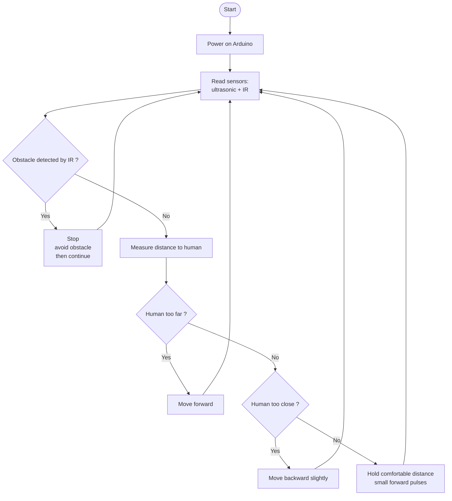

```mermaid
flowchart TD

A([Start]) --> B[Power on Arduino]

B --> C[Read sensors:\nultrasonic + IR]

C --> D{Obstacle detected by IR ?}
D -->|Yes| E[Stop\navoid obstacle\nthen continue]
E --> C

D -->|No| F[Measure distance to human]

F --> G{Human too far ?}
G -->|Yes| H[Move forward]
H --> C

G -->|No| I{Human too close ?}
I -->|Yes| J[Move backward slightly]
J --> C

I -->|No| K[Hold comfortable distance\nsmall forward pulses]
K --> C
```
