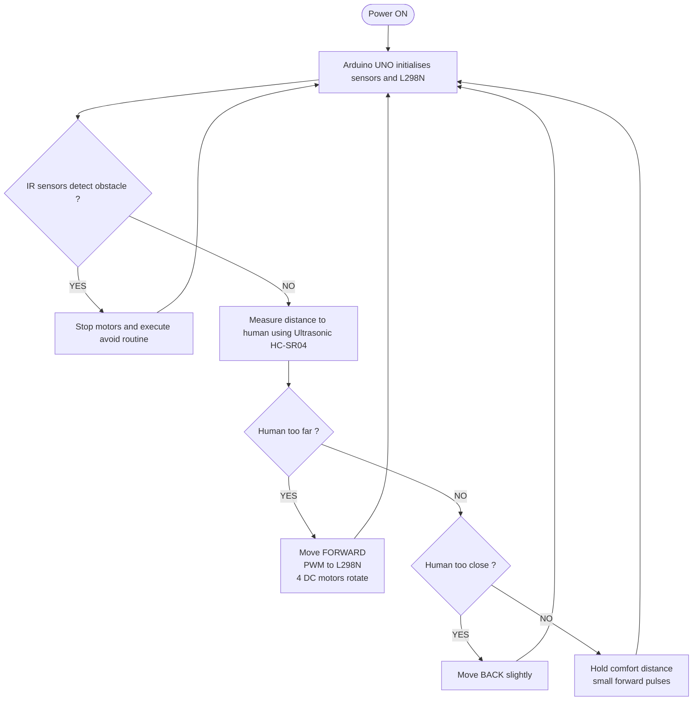

```mermaid
flowchart TD

A([Power ON]) --> B[Arduino UNO initialises sensors and L298N]

B --> C{IR sensors detect obstacle ?}
C -->|YES| D[Stop motors and execute avoid routine]
D --> B

C -->|NO| E[Measure distance to human using Ultrasonic HC-SR04]

E --> F{Human too far ?}
F -->|YES| G[Move FORWARD\nPWM to L298N\n4 DC motors rotate]
G --> B

F -->|NO| H{Human too close ?}
H -->|YES| I[Move BACK slightly]
I --> B

H -->|NO| J[Hold comfort distance\nsmall forward pulses]
J --> B
```
