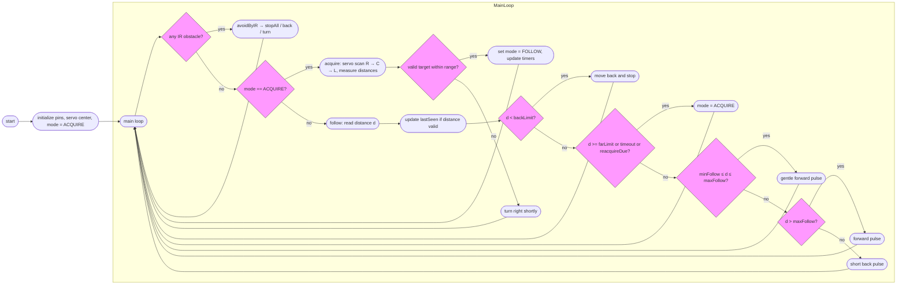

```mermaid
flowchart LR
  Start([start]) --> Init([initialize pins, servo center, mode = ACQUIRE])
  Init --> Loop([main loop])

  subgraph MainLoop
    Loop --> CheckIR{any IR obstacle?}
    CheckIR -- yes --> Avoid([avoidByIR → stopAll / back / turn])
    Avoid --> Loop

    CheckIR -- no --> ModeCheck{mode == ACQUIRE?}
    ModeCheck -- yes --> Acquire([acquire: servo scan R → C → L, measure distances])
    Acquire --> Found{valid target within range?}
    Found -- yes --> SetFollow([set mode = FOLLOW, update timers])
    SetFollow --> Loop
    Found -- no --> Rotate([turn right shortly])
    Rotate --> Loop

    ModeCheck -- no --> Follow([follow: read distance d])
    Follow --> UpdateDist([update lastSeen if distance valid])
    UpdateDist --> TooClose{d < backLimit?}
    TooClose -- yes --> Back([move back and stop])
    Back --> Loop
    TooClose -- no --> Lost{d >= farLimit or timeout or reacquireDue?}
    Lost -- yes --> SetAcquire([mode = ACQUIRE])
    SetAcquire --> Loop
    Lost -- no --> InRange{minFollow ≤ d ≤ maxFollow?}
    InRange -- yes --> Gentle([gentle forward pulse])
    Gentle --> Loop
    InRange -- no --> TooFar{d > maxFollow?}
    TooFar -- yes --> ForwardBurst([forward pulse])
    TooFar -- no --> ShortBack([short back pulse])
    ForwardBurst --> Loop
    ShortBack --> Loop
  end

  classDef decision fill:#f9f,stroke:#333,stroke-width:1px;
  class CheckIR,ModeCheck,Found,TooClose,Lost,InRange,TooFar decision;
```
