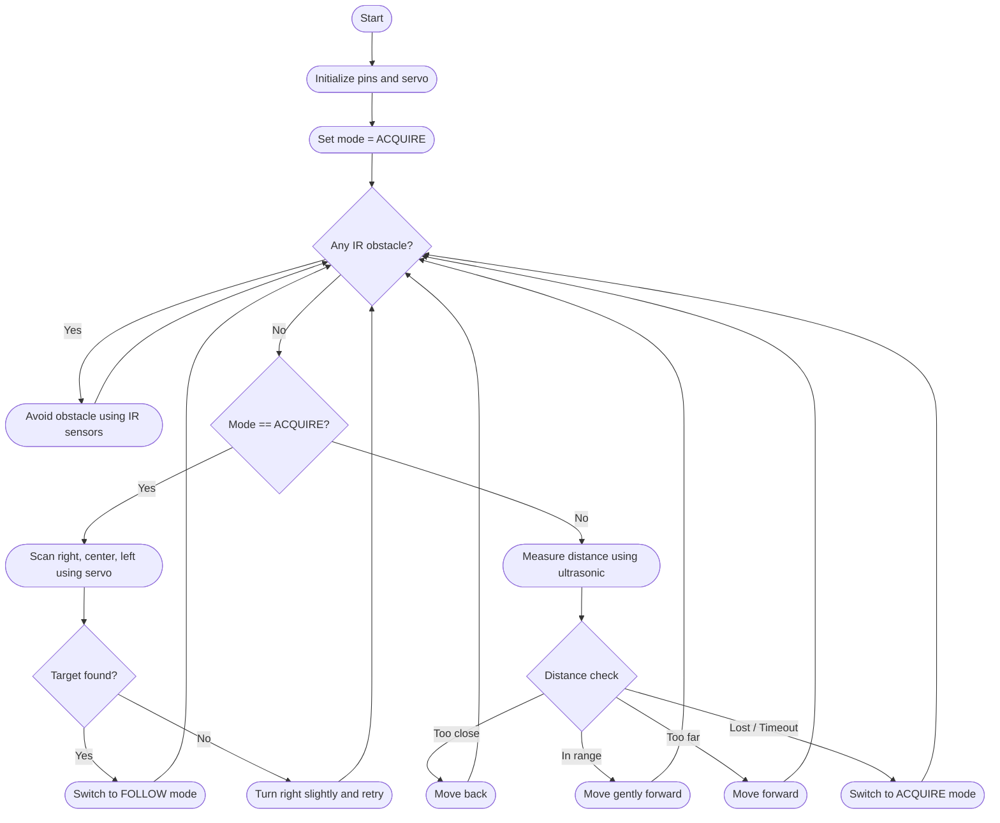

```mermaid
flowchart TD
  A([Start]) --> B([Initialize pins and servo])
  B --> C([Set mode = ACQUIRE])
  C --> D{Any IR obstacle?}

  D -- Yes --> E([Avoid obstacle using IR sensors])
  E --> D

  D -- No --> F{Mode == ACQUIRE?}
  F -- Yes --> G([Scan right, center, left using servo])
  G --> H{Target found?}
  H -- Yes --> I([Switch to FOLLOW mode])
  H -- No --> J([Turn right slightly and retry])
  J --> D
  I --> D

  F -- No --> K([Measure distance using ultrasonic])
  K --> L{Distance check}
  L -- Too close --> M([Move back])
  L -- In range --> N([Move gently forward])
  L -- Too far --> O([Move forward])
  L -- Lost / Timeout --> P([Switch to ACQUIRE mode])

  M --> D
  N --> D
  O --> D
  P --> D
```
