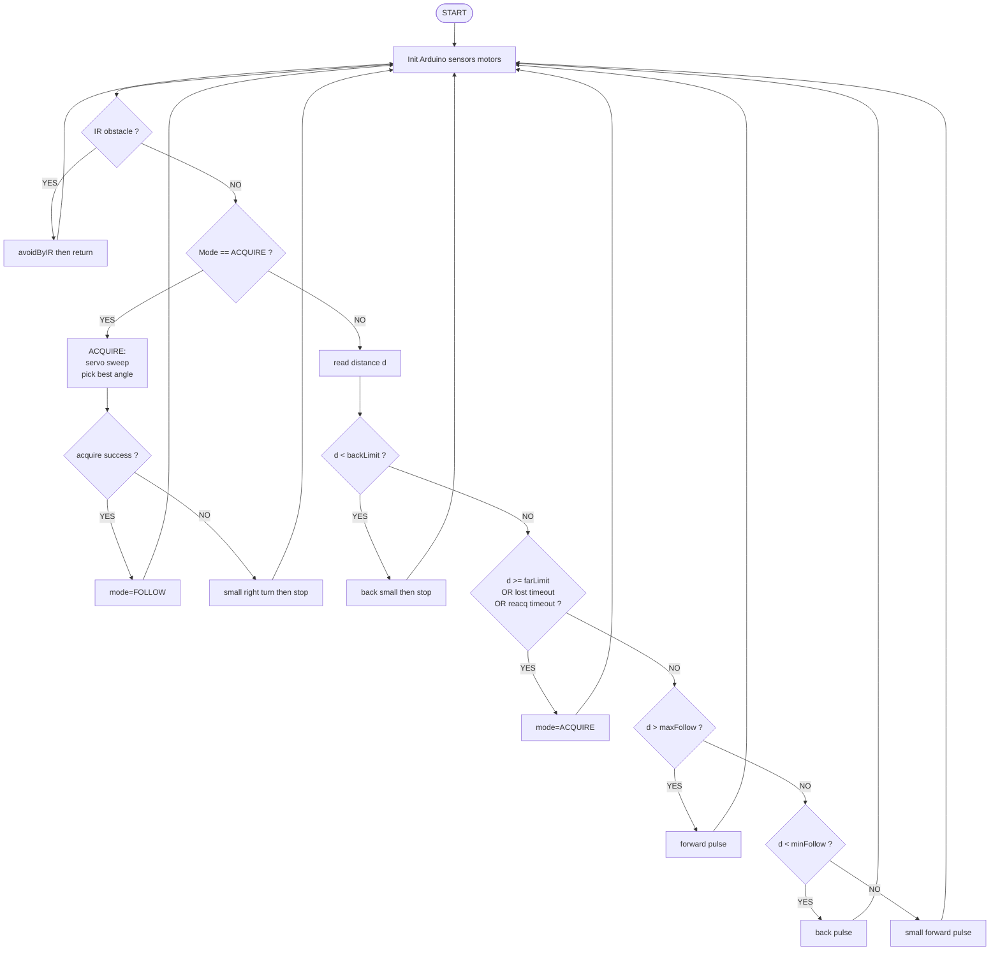

```mermaid
flowchart TD

A([START]) --> B[Init Arduino sensors motors]
B --> C{IR obstacle ?}
C -->|YES| D[avoidByIR then return]
D --> B

C -->|NO| E{Mode == ACQUIRE ?}

E -->|YES| F[ACQUIRE:\nservo sweep\npick best angle]
F --> G{acquire success ?}
G -->|YES| H[mode=FOLLOW]
H --> B
G -->|NO| I[small right turn then stop]
I --> B

E -->|NO| J[read distance d]

J --> K{d < backLimit ?}
K -->|YES| L[back small then stop]
L --> B

K -->|NO| M{d >= farLimit\nOR lost timeout\nOR reacq timeout ?}
M -->|YES| N[mode=ACQUIRE]
N --> B

M -->|NO| O{d > maxFollow ?}
O -->|YES| P[forward pulse]
P --> B

O -->|NO| Q{d < minFollow ?}
Q -->|YES| R[back pulse]
R --> B

Q -->|NO| S[small forward pulse]
S --> B
```
